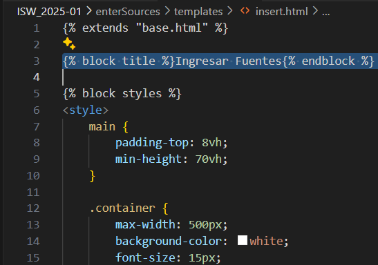
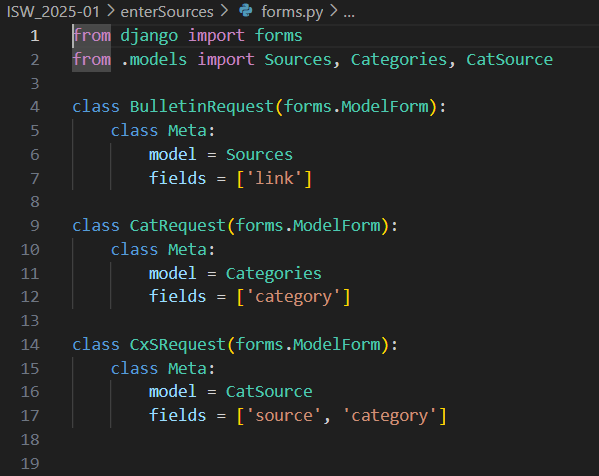
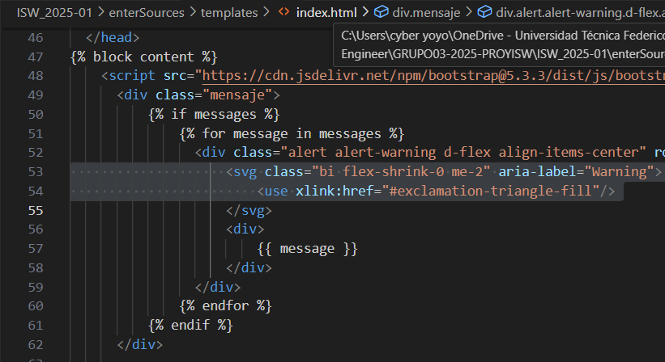

# Reporte de Reinspección - SonarQube Cloud

Este reporte detalla las acciones correctivas aplicadas a los Quality Issues identificados en la inspección inicial y verifica su resolución.

## Quality Issue 1: Inserción de Etiqueta `<title>` en Página HTML

* **Archivo:** `./ISW_2025-01/enterSources/templates/insert.html`
* **Línea Original del Issue:** 4
* **Calidad de Software Afectada:** Fiabilidad
* **Tipo:** Bug
* **Severidad:** Impacto Medio

### Resumen del Problema

La página HTML carecía de la etiqueta `<title>` dentro de su sección `<head>`, afectando la usabilidad y el SEO.

### Acción Correctiva Aplicada

Se añadió la etiqueta `Ingresar Fuentes` en la linea 3, este no va dentro del head, como se describio en el reporte inicial, ya que corresponde a una extension de `base.html`.

### Estado de Reinspección

**Corregido y Verificado**

### Evidencia

---

## Quality Issue 2: Aplicar Convención de Nombres de Clases

* **Archivo:** `./ISW_2025-01/enterSources/forms.py`
* **Línea Original del Issue:** 4
* **Calidad de Software Afectada:** Mantenibilidad
* **Tipo:** Code Smell
* **Severidad:** Bajo Impacto

### Descripción del Problema (Resumida)

La clase `Bulletin_request` no cumplía con la convención CamelCase para nombres de clases en Python (PEP 8, SonarQube S101).

### Acción Correctiva Aplicada

Se renombró la clase `Bulletin_request` a `BulletinRequest` en la línea 4. De esta misma manera se corrigieron el resto de las clases en `forms.py`.

### Estado de Reinspección

**Corregido y Verificado**

### Evidencia

---

## Quality Issue 3: Uso Correcto de Atributos ARIA en Elementos de Imagen o SVG

* **Archivo:** `./ISW_2025-01/enterSources/templates/index.html`
* **Línea Original del Issue:** 63
* **Calidad de Software Afectada:** Mantenibilidad
* **Tipo:** Code Smell
* **Severidad:** Impacto Medio

### Descripción del Problema (Resumida)

Se detectó un uso subóptimo o incorrecto de atributos ARIA para elementos gráficos (`role="img"`), afectando la accesibilidad.

### Acción Correctiva Aplicada

El elemento SVG en la línea 63 fue corregido para incluir `aria-label="Warning"`, proporcionando una descripción accesible para el icono sin depender de `role="img"` explícito en un contexto donde un SVG ya es semántico.

### Estado de Reinspección

**Corregido y Verificado**

### Evidencia

## Reinspección final

Se corrigió todos los Quality Issues presentes en el código del proyecto.
### Evidencia

