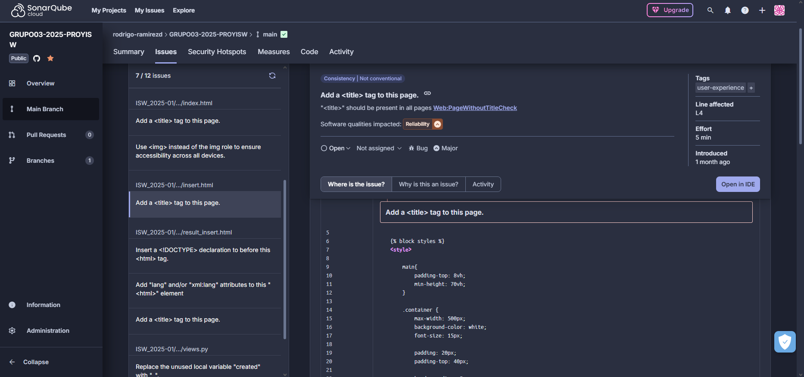

# Reporte de Inspección Inicial - SonarQube Cloud

## Quality Issue 1: Ausencia de Etiqueta `<title>` en Página HTML

* **Archivo:** `./ISW_2025-01/enterSources/templates/insert.html`
* **Línea:** 4
* **Calidad de Software Afectada:** Fiabilidad
* **Tipo:** Bug
* **Severidad:** Impacto Medio

### Descripción del Problema

La página HTML en el archivo `insert.html` **carece de la etiqueta `<title>`** dentro de su sección `<head>`. Esta omisión es reportada por la regla `Web:PageWithoutTitleCheck` de SonarQube y representa un **bug** que afecta directamente la usabilidad y la fiabilidad de la interfaz de usuario. Sin un título, la página es menos accesible, menos amigable para los usuarios (especialmente aquellos que usan lectores de pantalla), y tiene un impacto negativo en la optimización para motores de búsqueda (SEO).

### Recomendación

Se debe **agregar una etiqueta `<title>`** con un contenido descriptivo y apropiado para el propósito de la página dentro de la sección `<head>` del documento HTML.

* **Sugerencia específica de SonarQube:** Add a \<title> tag to this page.

### Acción Correctiva

Se procederá a **corregir inmediatamente** este problema agregando una etiqueta `<title>` descriptiva en la línea especificada. Esto mejorará la accesibilidad, la usabilidad y el SEO de la página.

---

## Quality Issue 2: Convención de Nombres de Clases

* **Archivo:** `./ISW_2025-01/enterSources/forms.py`
* **Línea:** 4
* **Calidad de Software Afectada:** Mantenibilidad
* **Tipo:** Code Smell
* **Severidad:** Bajo Impacto

### Descripción del Problema

La clase `Bulletin_request` no cumple con las **convenciones de nombres establecidas por Python (PEP 8)**, específicamente la regla **S101 de SonarQube**. Esto indica que el nombre utiliza un guion bajo (`_`) como separador, lo cual puede generar **confusión y dificultar la lectura y comprensión** del código. Los nombres poco convencionales o conflictivos impactan negativamente la mantenibilidad del software.

### Recomendación

Para resolver este problema, se recomienda **renombrar la clase `Bulletin_request`** para que cumpla con la convención **CamelCase**, que es el estándar para los nombres de clases en Python.

* **Sugerencia específica de SonarQube:** Rename class "Bulletin_request" to match the regular expression ^_?([A-Z_][a-zA-Z0-9]*|[a-z_][a-z0-9_]*)$.

### Acción Correctiva

La clase afectada en el archivo `forms.py` será **renombrada a `BulletinRequest`** en la próxima iteración de desarrollo. Esto asegurará que el código siga las mejores prácticas de Python, mejorando su legibilidad y facilitando futuras modificaciones y el mantenimiento.

---

## Quality Issue 3: Uso Incorrecto del Rol ARIA para Imágenes

* **Archivo:** `./ISW_2025-01/enterSources/templates/index.html`
* **Línea:** 63
* **Calidad de Software Afectada:** Mantenibilidad
* **Tipo:** Code Smell
* **Severidad:** Impacto Medio

### Descripción del Problema

En la línea 63 del archivo `index.html`, se está utilizando el atributo `role="img"` en lugar de la etiqueta semántica **``** para representar una imagen. Esta práctica es detectada por la regla `Web:S6819` de SonarQube y se considera un **Code Smell**. Aunque `role="img"` puede emular una imagen a nivel de accesibilidad, la etiqueta nativa `` es intrínsecamente más robusta y garantiza una **mejor accesibilidad y compatibilidad** con una gama más amplia de navegadores y tecnologías de asistencia. El uso de etiquetas semánticas cuando están disponibles es una buena práctica de mantenibilidad.

### Recomendación

Para asegurar la máxima accesibilidad y compatibilidad, se recomienda **reemplazar el elemento actual con la etiqueta ``** nativa de HTML, utilizando sus atributos estándar como `src`, `alt` y `width`/`height` según sea necesario.

* **Sugerencia específica de SonarQube:** Use  instead of the img role to ensure accessibility across all devices.

### Acción Correctiva

Se **corregirá la instanciación de la imagen** utilizando la etiqueta `` adecuada. Esto asegurará que la imagen sea renderizada y accesible correctamente en todos los dispositivos y por todas las tecnologías de asistencia, mejorando la mantenibilidad y la calidad general del código HTML.

